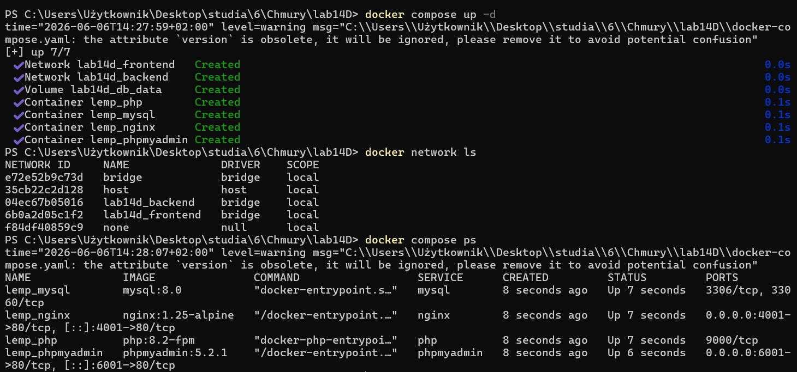
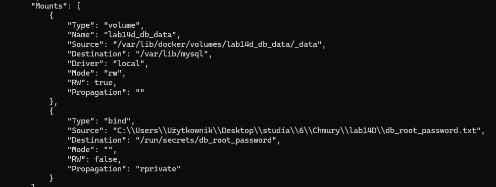
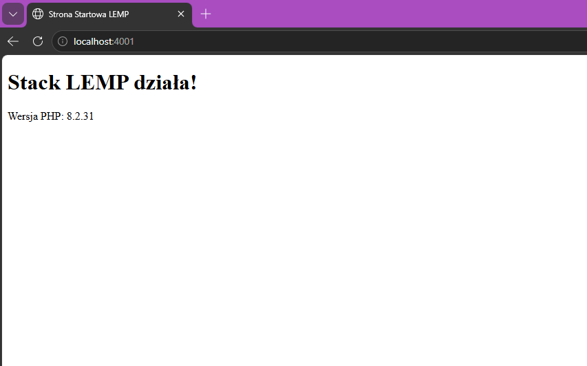
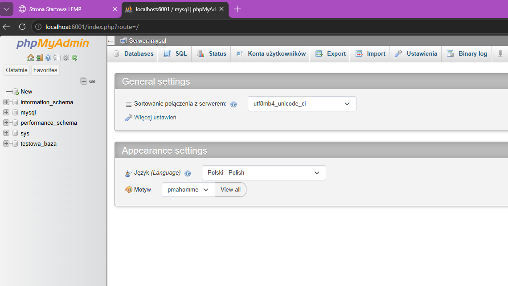
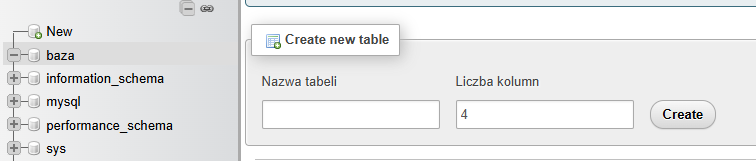

## Autor : Kinga Kowalska

## Opis
W ramach zadania zbudowano prosty plik docker-compose.yml, który uruchamia stack LEMP wraz z phpMyAdmin. Aplikacja zawiera cztery kontenery: Nginx, PHP(PHP-FPM), MySQL, phpMyAdmin. Wszystkie dane wykorzystywane przez aplikację LEMP uznane za wrażliwe skonfigurowano jako secret.

## Użyte polecenia i ich wyniki

1. **Uruchomienie środowiska w tle:**
   Polecenie: `docker compose up -d`

2. **Weryfikacja działających kontenerów:**
   Polecenie: `docker compose ps`

3. **Weryfikacja sieci:**
   Sieci zostały stworzone poprawnie, co można sprawdzić używając:
   `docker network ls`

Wyniki

## Dowody poprawnego działania
* **Potwierdzenie, że sekret został powiązany z serwisem za pomocą mechanizmu bind mounts**

* **Mimo modyfikacji na dane wrażliwe (secrets), zachowano wszystkie początkowe funkcjonalności projektu:**
* **Strona startowa PHP (Nginx na porcie 4001):** 
  Strona odpowiada pod adresem `http://localhost:4001` wyświetlając komunikat "Stack LEMP działa!" oraz informację o wersji php. 
  

* **Dostęp do phpMyAdmin (Port 6001) i inicjalizacja bazy:**
  Aplikacja jest dostępna pod adresem `http://localhost:6001`. Dzięki odpowiednim zmiennym środowiskowym przekazanym w pliku docker-compose.yaml, proces uwierzytelniania na konto administratora (root) odbywa się całkowicie automatycznie. Po załadowaniu interfejsu od razu widoczna jest zainicjowana testowa_baza.
  
  Baza zainicjalizowana ręcznie
  
